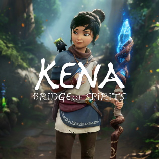

# Games I've Played

> A chronicling of the games I played each year.

## Ongoing

|                      Cover Art                       | Name                                                                  | Platform           | Review Score | Date | Completed |
| :--------------------------------------------------: | --------------------------------------------------------------------- | ------------------ | :----------: | :--: | :-------: |
|       | [Balatro](https://www.playbalatro.com/)                               | PC                 |      -       |  -   |     -     |
|  | [Helldivers 2](https://www.playstation.com/en-us/games/helldivers-2/) | PC                 |      -       |  -   |     -     |
|      | [Fortnite](https://www.fortnite.com/)                                 | PC/XBOX/PS5/Switch |      -       |  -   |     -     |

## Currently Playing

|                   Cover Art                    | Name                                                                 | Platform | Review Score |      Date      | Completed |
| :--------------------------------------------: | -------------------------------------------------------------------- | -------- | :----------: | :------------: | :-------: |
|    | [Night in the Woods](http://www.nightinthewoods.com/)                | PC       |      -       |  March, 2024   |     -     |
|  | [ReCore](https://www.xbox.com/en-US/games/store/recore/9nblggh1z6fq) | PC/XBOX  |      -       | February, 2024 |     -     |

## Upcoming

|                                Cover Art                                | Name                                                                                                                 | Platform | Review Score | Date | Completed |
| :---------------------------------------------------------------------: | -------------------------------------------------------------------------------------------------------------------- | -------- | :----------: | :--: | :-------: |
|                      | [Alan Wake 2](https://www.alanwake.com/)                                                                             | XBOX     |      -       |  -   |     -     |
|  | [Prince of Persia The Lost Crown](https://www.ubisoft.com/en-us/game/prince-of-persia/the-lost-crown)                | PC       |      -       |  -   |     -     |
|      | [Life is Strange: True Colors](https://lifeisstrange.square-enix-games.com/en-us/games/life-is-strange-true-colors/) | PS5      |      -       |  -   |     -     |
|                           | [COCOON](https://www.cocoongame.com/)                                                                                | PC/XBOX  |      -       |  -   |     -     |

## 2024

|                                   Cover Art                                   | Name                                                                             | Platform | Review Score |      Date      | Completed |
| :---------------------------------------------------------------------------: | -------------------------------------------------------------------------------- | -------- | :----------: | :------------: | :-------: |
|                            | [Crackdown 3](https://www.crackdown.com/)                                        | XBOX     |      -       | February, 2024 |    ✅     |
|  | [Suicide Squad: Kill the Justice League](https://www.suicidesquadgame.com/en-us) | PC       |  ⭐️ 10/10   | February, 2024 |    ✅     |
|                              | ["DEATHLOOP"](https://bethesda.net/en/game/deathloop)                            | PC/PS5   |  ⭐️ 10/10   | January, 2024  |    ✅     |
|                  | [Red Dead Redemption II](https://www.rockstargames.com/reddeadredemption2/)      | PC       |      -       | January, 2024  |     -     |

## 2023

|                            Cover Art                            | Name                                                                             | Platform | Review Score |      Date       | Completed |
| :-------------------------------------------------------------: | -------------------------------------------------------------------------------- | -------- | :----------: | :-------------: | :-------: |
|                  | [Control](https://www.remedygames.com/games/control)                             | PS5      |      -       | December, 2023  |    ✅     |
|  | [Oxenfree II: Lost Signals](https://nightschoolstudio.com/oxenfree-ii)           | PC       |  ⭐️ 10/10   | December, 2023  |    ✅     |
|           | [The Pedestrian](https://www.skookum-arts.com/)                                  | PS5      |      -       | November, 2023  |     -     |
|      | [God of War Ragnarök](https://www.playstation.com/en-us/god-of-war/)             | PS5      |      -       | November, 2023  |     -     |
|             | [Spider-Man 2](https://insomniac.games/game/marvels-spider-man-2/)               | PS5      |      -       | November, 2023  |    ✅     |
|           | [Baldur's Gate 3](https://baldursgate3.game/)                                    | PC       |      🍿      | November, 2023  |     -     |
|        | [Watch Dogs: Legion](https://www.ubisoft.com/en-us/game/watch-dogs/legion)       | PC/XBOX  |     ⭐️      | September, 2023 |    ✅     |
|             | [Watch Dogs 2](https://www.ubisoft.com/en-us/game/watch-dogs/watch-dogs-2)       | PC/XBOX  |     ⭐️      | September, 2023 |    ✅     |
|     | [The Expanse: A Telltale Series](https://www.telltale.com/the-expanse/)          | XBOX     |      -       |  August, 2023   |     -     |
|                 | [Pikmin 4](https://www.nintendo.com/us/store/products/pikmin-4-switch/)          | Switch   |      -       |   July, 2023    |     -     |
|  | [STAR WARS Jedi: Survivor](https://www.ea.com/games/starwars/jedi/jedi-survivor) | PS5      |      -       |   July, 2023    |     -     |
|                  | [Redfall](https://bethesda.net/en/game/redfall)                                  | PC       |      👎      |    May, 2023    |     -     |
|            | [Dead Island 2](https://deadisland.com/)                                         | PC       |  ⭐️ 10/10   |    May, 2023    |     -     |
|               | [Hi-Fi Rush](https://bethesda.net/en-US/game/hifirush)                           | PC/XBOX  |  ⭐️ 10/10   |   March, 2023   |    ✅     |
|                  | [Gears 5](https://www.gearsofwar.com/games/gears-5/)                             | PC/XBOX  |      -       | February, 2023  |    ✅     |

### Notes

- **Control** - Revisited because of Alan Wake. Assist mode enabled.
- **Spider-Man 2** - Difficultly spike at the end was nuts. Had to turn down the difficulty at the very end.
- **Redfall** - I tried. Twice.
- **Gears 5** - Finally! I was a little behind on this one.

## 2022

|                           Cover Art                            | Name                                                                                      | Platform | Review Score |      Date       | Completed |
| :------------------------------------------------------------: | ----------------------------------------------------------------------------------------- | -------- | :----------: | :-------------: | :-------: |
|            | [High On Life](https://squanchgames.com/high-on-life/)                                    | PC       |      -       | December, 2022  |    ✅     |
|      | [Ghosts of Tsushima](https://www.suckerpunch.com/category/games/ghost-of-tsushima/)       | PS5      |     ⭐️      |  October, 2022  |     -     |
|          | [Gotham Knights](https://www.gothamknightsgame.com/en-us)                                 | PS5      |      👎      |  October, 2022  |     -     |
|              | [Saints Row](https://saintsrow.com/)                                                      | PC       |      -       | September, 2022 |    ✅     |
|                   | [Stray](https://stray.game/)                                                              | PS5      |      -       |  August, 2022   |     -     |
|           | [Halo Infinite](https://www.halowaypoint.com/halo-infinite)                               | PC/XBOX  |      -       |   June, 2022    |    ✅     |
|  | [TMNT: Shredder's Revenge](https://www.shredders-revenge.com/)                            | PC/XBOX  |      🍿      |   June, 2022    |     -     |
|  | [Horizon Forbidden West](https://www.playstation.com/en-us/games/horizon-forbidden-west/) | PS5      |      -       |   March, 2022   |     -     |
|              | [God of War](https://www.playstation.com/en-us/god-of-war/)                               | PS5      |  ⭐️ 10/10   | February, 2022  |    ✅     |

### Notes

- **Ghosts of Tsushima** - Love this game, I'm just not great at it.
- **God of War** - Had to drop it down to easy unfortunately. Glad I did because it was an awesome game.

## 2021

|                              Cover Art                               | Name                                                                                                                              | Platform | Review Score |      Date       | Completed |
| :------------------------------------------------------------------: | --------------------------------------------------------------------------------------------------------------------------------- | -------- | :----------: | :-------------: | :-------: |
|       | [Guardians of the Galaxy](https://www.marvel.com/games/marvels-guardians-of-the-galaxy)                                           | PS5      |      -       | December, 2021  |    ✅     |
|                     | [Far Cry 6](https://www.ubisoft.com/en-us/game/far-cry/far-cry-6)                                                                 | PS5      |     🙋‍♂️🙋‍♂️     |  October, 2021  |     -     |
|                 | [Metroid Dread](https://metroid.nintendo.com/)                                                                                    | Switch   |      -       |  October, 2021  |     -     |
|        | [Kena: Bridge of Spirits](https://emberlab.com/)                                                                                  | PS5      |      -       | September, 2021 |     -     |
|  | [Ratchet & Clank: Rift Apart](https://insomniac.games/game/ratchet-clank-rift-apart/)                                             | PS5      |  ⭐️ 10/10   |  August, 2021   |    ✅     |
|      | [Spider-Man: Miles Morales](https://insomniac.games/game/marvels-spider-man-miles-morales/)                                       | PS5      |  ⭐️ 10/10   |   July, 2021    |    ✅     |
|      | [Assassin's Creed Valhalla](https://www.ubisoft.com/en-us/game/assassins-creed/valhalla)                                          | PS4      |      🥱      |   July, 2021    |     -     |
|                      | [Returnal](https://housemarque.com/games/returnal)                                                                                | PS5      |      🚪      |   July, 2021    |     -     |
|     | [Uncharted: The Lost Legacy](https://www.playstation.com/en-us/uncharted/l)                                                       | PS4      |      -       |   July, 2021    |    ✅     |
|             | [Horizon Zero Dawn](https://www.playstation.com/en-gb/games/horizon-zero-dawn/)                                                   | PS4      |  ⭐️ 10/10   |   July, 2021    |    ✅     |
|             | [Ratchet & Clank](https://insomniac.games/game/ratchet-and-clank-ps4/)                                                            | PS4      |  ⭐️ 10/10   |   April, 2021   |    ✅     |
|      | [Spider-Man: Miles Morales](https://insomniac.games/game/marvels-spider-man-miles-morales/)                                       | PS4      |  ⭐️ 10/10   |   March, 2021   |    ✅     |
|          | [Super Mario 3D World + Bowser's Fury](https://www.nintendo.com/us/store/products/super-mario-3d-world-plus-bowsers-fury-switch/) | Switch   |      🍿      | February, 2021  |     -     |

### Notes

- **Ratchet & Clank: Rift Apart** - I actually got all achievements for this on the PS5!

## Legend

| Emoji | Description                                      |
| :---: | ------------------------------------------------ |
|  ⭐️  | Loved the game                                   |
|  🍿   | Liked the game, keep coming back to it           |
| 🙋‍♂️🙋‍♂️  | Liked the game, playing it casually with friends |
|  🥱   | Got bored                                        |
|  👎   | Didn't like it                                   |
|  🚪   | Gave up                                          |
